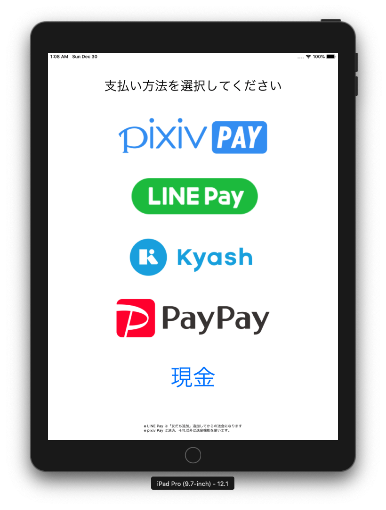
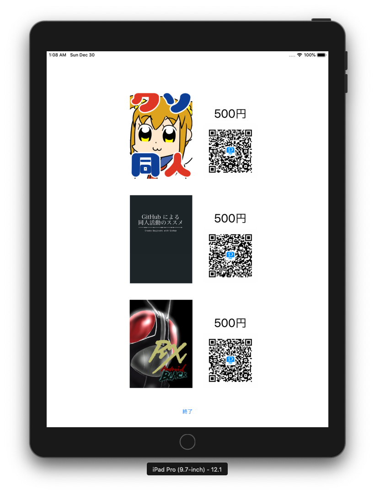

class: center, middle

# iPadで決済用QRコードを表示するアプリをコミケで使った話

---

## 世は決済サービス戦国時代

---

## コミケでも決済サービスを使うサークルが増加

#### 2014
- [電子マネー決済の波、コミケにも――サークル「自転車操業」が導入を決めたわけ \- ITmedia エンタープライズ](https://www.itmedia.co.jp/bizid/articles/1401/17/news007.html)

#### 2018
- [コミケでクレカ・電子マネー・QR決済に対応　「電子決済を極めまくったサークル」に話を聞いた \- ねとらぼ](https://nlab.itmedia.co.jp/nl/articles/1808/29/news091.html)

 

.x-large.red.center[決済サービスで決済することが目的]
.center[のサークルもあるくらい]

---

## 主な決済サービス

- 現金
- クレジットカード
- 電子マネー
- QRコード決済

---

## 決済サービスは敷居が高い
### 対象
- × 個人
- ○ 企業

.center[個人の審査通過 → 高難易度]

---

## 個人向け決済サービス？

.center[そんなものはない]

.center[代わりは...？]

---

class: center, middle

## 個人間送金サービス

---

## 個人間送金サービスとは？

スマートフォンアプリを使って個人から個人へ送金するサービス

- LINE Pay、pring〈メタップス・みずほ〉 (資金移動業者)
- PayPay、楽天ペイ、Kyash (前払い式支払い手段発行業者)
- Paymo (サービス終了・収納代行業者)
- Money Tap〈SBI〉、J-Coin Pay〈みずほ〉（電子決済等代行業）

---

## QRコード送金にする訳

- とにかく導入が楽
- 事業者でなくても送金機能を使えば手数料が0円
- 送金したマネーは即利用可能

 
 
 

.center.x-large[要するに..red[金]]

---

## QRコードの他のメリット

- フレンド登録が楽
- スマホで扱える

---

## 決済・送金サービスのデメリット

- 個人情報が漏れる可能性がある
  - 友達同士じゃないと送れない 等
- 使いたいサービスのズレ
- 通信状態

---

## 海外の送金事情

海外がやってるからといって正解ではない

- 中国
  - Alipay、WeChat Pay
- 欧州
  - デビットカードが主流で銀行に直接送金
- 日本
  - お年玉
  - 現金

---

## 今回コミケで採用したもの

現金払いの他に

- Kyash
- PayPay
- LINE Pay

---

## コミケで過去に採用していたもの

### paymo biz
- サービス終了
- 個別に商品を管理できるので非常に優秀でした
- 大手企業による高額還元には勝てなかった

### pixiv PAY
- 弱小サークルだと出金手数料が非常に高い
- 受け取ったマネーをチャージして利用できない
  - 一度出金してから再チャージする必要がある

---

## 不採用だが一度は考えたもの

知名度が低い・決済手数料が高い・送金機能がない・導入に審査がある 等が理由

- Sma-sh pay
- 楽天ペイ
- Coiney
- pring
- じぶん銀行
- J-Coin Pay
- PayPal
- ドコモ口座

等（多すぎてリスト化が大変）

---

## 使ったアプリ

押すと QRコードが表示されるアプリ

---

## アプリ開発費用

0円

---

## 有料ライセンス不要

無料のプロビジョニング・プロファイルの有効期限は7日間

コミケだけなら1日なので実質無料

年間11,800円のライセンス料は不要

詳しくは[こちら](https://dev.classmethod.jp/smartphone/run-on-devices-without-apple-developer-program-license/)

---

## アプリ・デバイスに求められるもの

- 十分なバッテリー
- 画面の永続表示
- 正常なQRコード
- 清潔さ（画面拭けよ）
- 視認性

---

## 十分なバッテリー

iPad Pro で十分

---

## 画面の永続表示

Webでは不可、アプリにして画面永続表示

---

## 清潔さ（画面拭けよ）

画面拭きは必須

---

## 実績

C97では約30件中Kyashで3件.super[.small[※1]]の支払いがあった。他は現金。

.small[※1: 3件中1件は知人で決済サービス関連のサークルで参加する方]

---

## 実際にやってみて

- 一部のAndroid端末で正しくQRコードを読み込めなかった。
- 手に持った状態の現金支払いのスピードには勝てない。
- お釣りなくて楽
- 初めての試みなので手間取る客が多く遅い

---

## 決済速度順位

0. 比村サーキット
1. 手持ち500円
2. 手持ち1,000円
3. 財布1,000円
4. 財布500円
5. Kyash

---

## おわりに

.center[コミケで決済サービスの需要はある]

.center[よりスピーディーで敷居の低い.red[**送金**]サービスが必要]