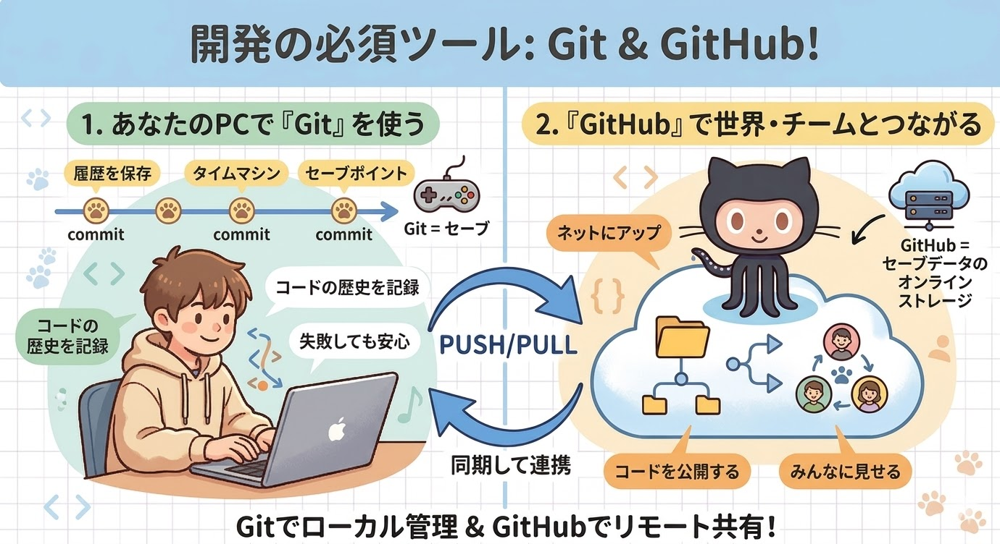
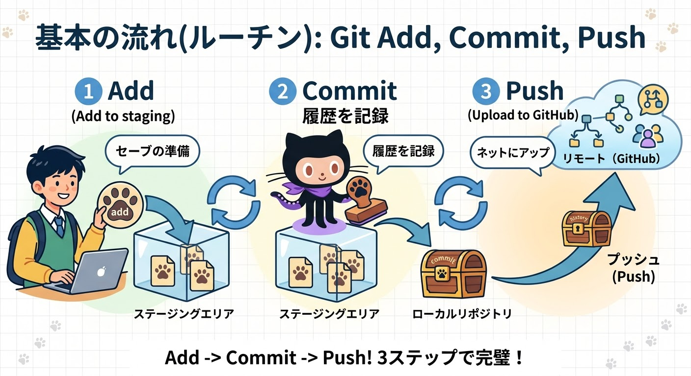

class: center, middle, inverse

# 怖くない GitHub 入門講座
### 〜 情報学部1年生のための生存戦略 〜

---

<!-- 
## 今日伝えたいこと

1.  **Git と GitHub は怖くない**
  * 「難しそう…」と思うかもしれませんが
2.  **基本の流れを覚えれば大丈夫**
  * 編集 → Add → Commit → Push の順番を覚えるだけで OK
3.  **詰まったときの対処法も知っておこう**
  * エラーが出たら、まずはエラーメッセージを Google/ChatGPT に投げる（真理）

---

## そもそも Git / GitHub ってなに？

* **Git**: 自分の PC 内でファイルの「変更履歴」を記録する道具
* **GitHub**: Git の記録を「ネット上」に保管して、みんなと共有する場所

> **例えるなら…**
> Git は「ゲームのセーブポイント」
> GitHub は「セーブデータのオンラインストレージ」

.center[

]

---

## 最初の 3 大用語

1.  **Repository (リポジトリ)**: プロジェクトの保管箱
2.  **Commit (コミット)**: セーブする（変更を記録する）
3.  **Push (プッシュ)**: GitHub にセーブデータをアップロードする

---

## 基本の流れ（ルーチンワーク）

まずはこの順番を呪文のように覚えましょう！

1.  **編集する**: コードを書く
2.  **Add**: セーブする準備（ステージング）
    * `git add .`
3.  **Commit**: セーブ完了！
    * `git commit -m "〇〇を作った"`
4.  **Push**: ネットに送る
    * `git push origin main`

.right[

]

---

## 詰まった時の対処法

* **エラーメッセージをそのまま Google/ChatGPT に投げる**
    * だいたい 9 割はこれで解決します。
* **「いまどうなってる？」を確認する**
    * `git status` を打つクセをつけよう。
* **消しちゃいけないフォルダ**
    * `.git` という隠しフォルダは触らないように！（これが歴史の本体です）

---

class: center, middle, inverse

# 習うより慣れよう！
## 実際にリポジトリを作ってみましょう -->